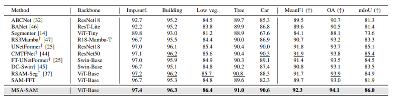
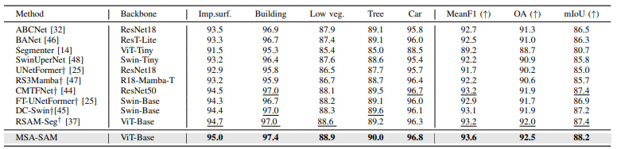
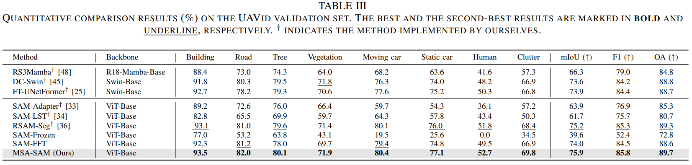
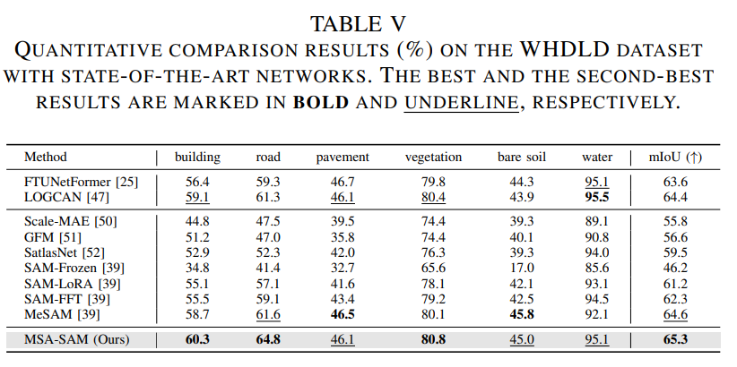
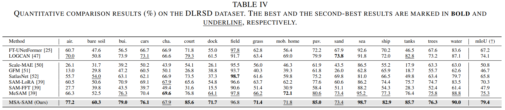

# Mult-scale-SAM
## Introduction

**MSA-SAM** is an open-source  semantic segmentation toolbox based on PyTorch, [pytorch](https://pytorch.org/) and [timm](https://github.com/rwightman/pytorch-image-models), 
which mainly focuses on developing advanced Vision Transformers for remote sensing image segmentation. 

Our proposed method is based on Segment Anything model and adapt it to remote sensing image segmentation.

## Major Features

- Unified Benchmark

  we provide a unified training script for various segmentation methods.
  
- Simple and Effective

  Thanks to **pytorch lightning** and **timm** , the code is easy for further development.
  
- Supported Remote Sensing Datasets
 
  - [ISPRS Vaihingen and Potsdam](https://www.isprs.org/education/benchmarks/UrbanSemLab/default.aspx) 
  - [UAVid](https://uavid.nl/)
  - WHDLD
  - DLRSD
  - More datasets will be supported in the future.
  
- Multi-scale Training and Testing
- Inference on Huge Remote Sensing Images

## Supported Network
  - [UNetFormer](https://authors.elsevier.com/a/1fIji3I9x1j9Fs) 
  - [DC-Swin](https://ieeexplore.ieee.org/abstract/document/9681903)
  - [CMTFNet](https://ieeexplore.ieee.org/document/10247595)
  - [RS3Mamba](https://arxiv.org/abs/2404.02457)
  - [RSAM-Seg](https://arxiv.org/abs/2402.19004)
  - [ABCNet](https://arxiv.org/abs/2102.02531)
  
  
## Folder Structure

Prepare the following folders to organize this repo:
```none
airs
├── MSA-SAM (code)
├── pretrained_models (pretrained weights of backbones, such as vit, swin, etc)
├── model_weights (save the model weights trained on ISPRS vaihingen, LoveDA, etc)
├── fig_results (save the masks predicted by models)
├── data
│   ├── uavid
│   │   ├── uavid_train (original)
│   │   ├── uavid_val (original)
│   │   ├── uavid_test (original)
│   │   ├── uavid_train_val (Merge uavid_train and uavid_val)
│   │   ├── train (processed)
│   │   ├── val (processed)
│   │   ├── train_val (processed)
│   ├── vaihingen
│   │   ├── train_images (original)
│   │   ├── train_masks (original)
│   │   ├── test_images (original)
│   │   ├── test_masks (original)
│   │   ├── test_masks_eroded (original)
│   │   ├── train (processed)
│   │   ├── test (processed)
│   ├── potsdam (the same with vaihingen)
```

## Install
```
conda create -n sam python=3.8
conda activate sam
pip install torch==1.12.0+cu116 torchvision==0.13.0+cu116 torchaudio==0.12.0 --extra-index-url https://download.pytorch.org/whl/cu116
pip install -r requirements.txt
```

## Data Preprocessing

Download the datasets from the official website and split them yourself. We adopt the data processing method in the UNetFormer(https://authors.elsevier.com/a/1fIji3I9x1j9Fs) 

## Training
```
python MSA-SAM/train.py --AdamW
```
## Testing

```
python MSA-SAM/test.py --rgb -t 'd4'
```

## Reproduction Results
|    Method     |  Dataset  |  F1   |  OA   |  mIoU |
|:-------------:|:---------:|:-----:|:-----:|------:|
|    MSA-SAM    |   UAVid   | 85.8  | 89.7  | 75.9  |
|    MSA-SAM    | Vaihingen | 92.0  | 93.9  | 85.5  |
|    MSA-SAM    |  Potsdam  | 93.3  | 92.1  | 87.7  |
|    MSA-SAM    |  DLRSD    |   -   |   -   | 79.4  |
|    MSA-SAM    |  WHDLD    |   -   |   -   | 65.3  |

## Comparison with other methods

**Vaihingen Dataset**
<div>

</div>
**Potsdam Dataset**
</div>

</div>
**UAVid Dataset**
</div>

</div>
**WHDLD Dataset**
</div>

</div>
**DLRSD Dataset**
</div>

</div>

## Acknowledgement
Our work is built on the codebase of [SAM-LST](https://github.com/11yxk/SAM-LST) and [P2T](https://github.com/yuhuan-wu/P2T). We sincerely thank for their exceptional work.

